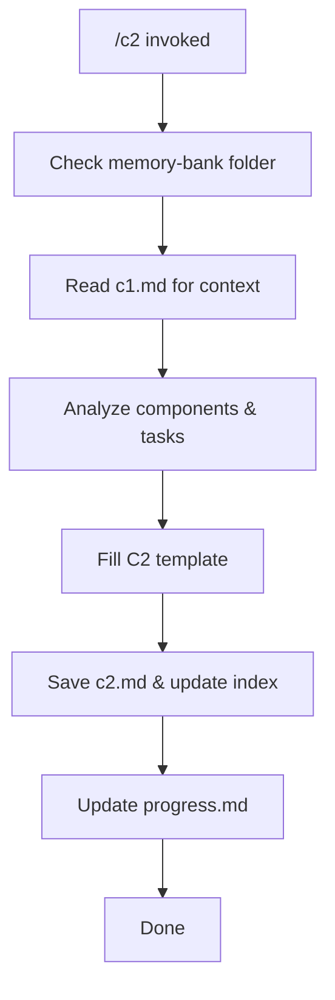

# MEMORY BANK SYSTEM SCHEME C2 PROMPT

Create or update a component-level scheme that details interactions between the service components, their protocols, and external systems. Follow the template from `system-scheme-management.md`. Save it under `memory-bank/system-schemes/c2.md`.

## Process Overview

