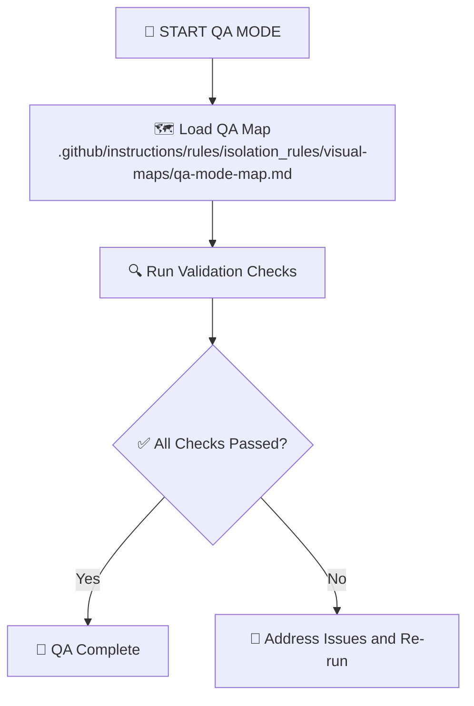

# MEMORY BANK QA MODE

Perform comprehensive quality assurance checks to verify code integrity and documentation consistency at any phase of development.

```mermaid
graph TD
    Start["🚀 START QA MODE"] --> LoadMap["🗺️ Load QA Map<br>.github/instructions/rules/isolation_rules/visual-maps/qa-mode-map.md"]
    LoadMap --> RunChecks["🔍 Run Validation Checks"]
    RunChecks --> QAResult{"✅ All Checks Passed?"}
    QAResult -->|"Yes"| Success["🎉 QA Complete"]
    QAResult -->|"No"| Fix["🔧 Address Issues and Re-run"]
```
