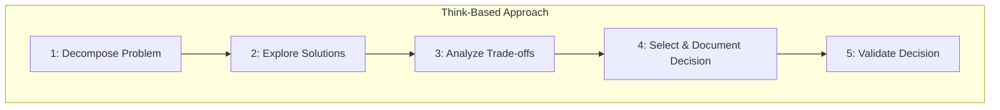

# CREATIVE Mode and the Think Methodology

This document outlines how the CREATIVE phase applies a structured think-based approach to exploring design options and documenting decisions.

## Conceptual Parallels

The CREATIVE mode mirrors this workflow by breaking down complex components, evaluating alternatives, recording reasoning, and validating choices before implementation.
